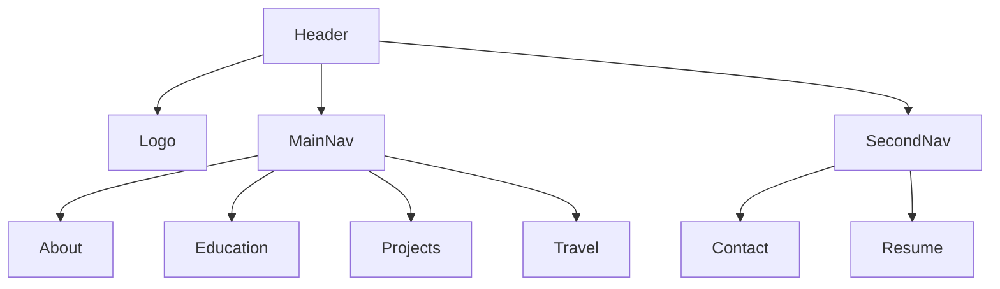
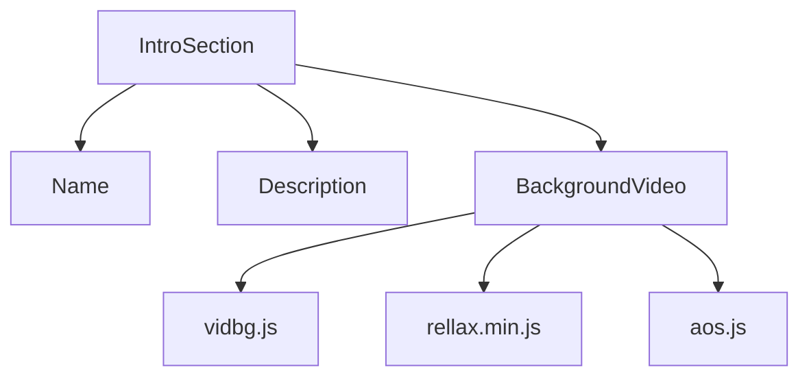
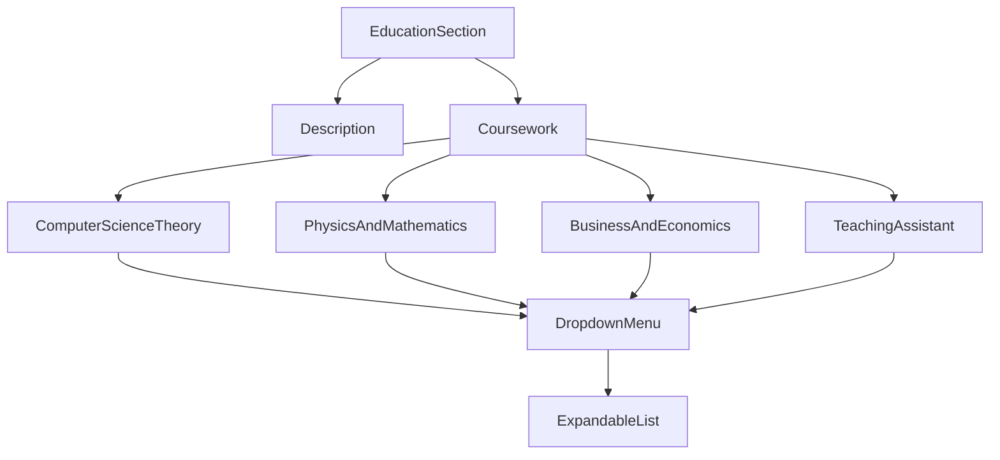
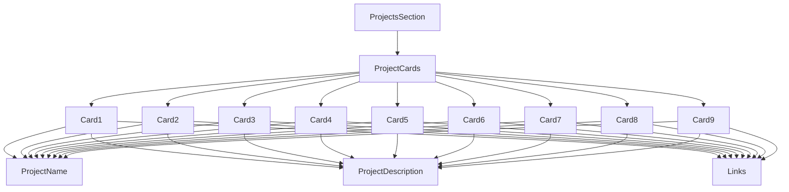
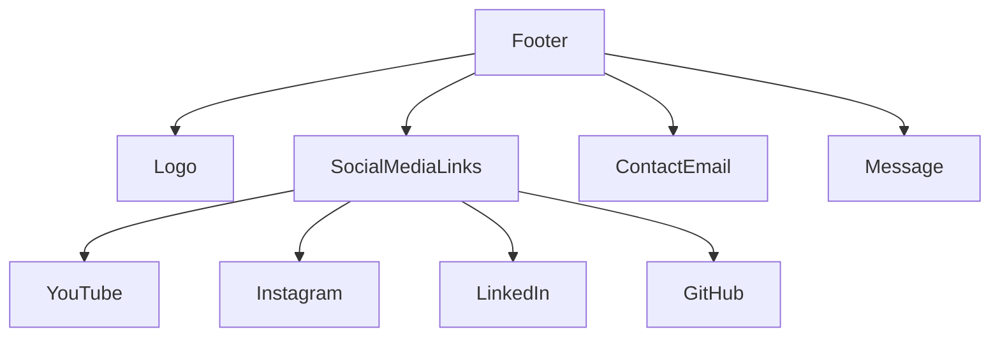

Relevant source files

The following files were used as context for generating this wiki page:

- [index.html](https://github.com/agattani123/agattani123.github.io/blob/master/index.html)
- [js/main.js](https://github.com/agattani123/agattani123.github.io/blob/master/js/main.js)
- [css/style.css](https://github.com/agattani123/agattani123.github.io/blob/master/css/style.css)
- [js/vidbg.js](https://github.com/agattani123/agattani123.github.io/blob/master/js/vidbg.js)
- [js/rellax.min.js](https://github.com/agattani123/agattani123.github.io/blob/master/js/rellax.min.js)
- [js/aos.js](https://github.com/agattani123/agattani123.github.io/blob/master/js/aos.js)
- [js/script.js](https://github.com/agattani123/agattani123.github.io/blob/master/js/script.js)
- [js/type.js](https://github.com/agattani123/agattani123.github.io/blob/master/js/type.js)

# Home Page

## Introduction

The provided source files represent a personal website for Arnav Gattani, a computer science and physics student at the University of Pennsylvania. The website serves as a portfolio showcasing Arnav's education, projects, and travel experiences. It is built using HTML, CSS, and JavaScript, with additional libraries and frameworks for enhanced functionality and animations.

The main page (`index.html`) is the entry point of the website, featuring sections for an introduction, education details, project highlights, and a footer with social media links and contact information. The website incorporates various JavaScript libraries and custom scripts to create interactive elements, animations, and dynamic content.

Sources: [index.html](https://github.com/agattani123/agattani123.github.io/blob/master/index.html), [js/main.js](https://github.com/agattani123/agattani123.github.io/blob/master/js/main.js), [css/style.css](https://github.com/agattani123/agattani123.github.io/blob/master/css/style.css)

## Header and Navigation

The website's header consists of a logo, a main navigation menu, and a secondary navigation menu. The main navigation menu includes links to different sections of the website, such as "About," "Education," "Projects," and "Travel." The secondary navigation menu provides links for "Contact" and "Resume."

The header is implemented using HTML and styled with CSS. The navigation menus are created using unordered lists (`<ul>`) with list items (`<li>`) containing anchor tags (`<a>`) for each link.

Sources: [index.html:14-38](https://github.com/agattani123/agattani123.github.io/blob/master/index.html#L14-L38), [css/style.css:46-72](https://github.com/agattani123/agattani123.github.io/blob/master/css/style.css#L46-L72)

## Introduction Section

The introduction section is the main focal point of the home page, featuring Arnav's name, a brief description, and a background video. The section is styled with CSS and utilizes the AOS (Animate on Scroll) library for animation effects.

The background video is implemented using the `vidbg.js` library, which plays a looping video in the background. The `rellax.min.js` library is used for parallax effects, and `aos.js` provides animations when scrolling.

Sources: [index.html:41-52](https://github.com/agattani123/agattani123.github.io/blob/master/index.html#L41-L52), [js/main.js:1-9](https://github.com/agattani123/agattani123.github.io/blob/master/js/main.js#L1-L9), [css/style.css:73-105](https://github.com/agattani123/agattani123.github.io/blob/master/css/style.css#L73-L105)

## Education Section

The education section provides details about Arnav's academic background, including his majors, minors, and coursework at the University of Pennsylvania. It features an expandable dropdown menu for displaying different categories of courses.

The coursework is presented using a dropdown menu implemented with HTML, CSS, and JavaScript. Each dropdown menu item expands to reveal a list of courses within that category.

Sources: [index.html:54-160](https://github.com/agattani123/agattani123.github.io/blob/master/index.html#L54-L160), [css/style.css:106-165](https://github.com/agattani123/agattani123.github.io/blob/master/css/style.css#L106-L165)

## Projects Section

The projects section showcases Arnav's various projects, each represented by a card with a brief description and links to relevant resources (e.g., GitHub, DevPost). The cards are designed with a flip animation effect, revealing additional details when hovered over or clicked.

The project cards are implemented using HTML and CSS, with the flip animation effect achieved through CSS transitions and transformations. Each card contains a project name, description, and links to relevant resources (e.g., GitHub, DevPost).

Sources: [index.html:163-298](https://github.com/agattani123/agattani123.github.io/blob/master/index.html#L163-L298), [css/style.css:167-329](https://github.com/agattani123/agattani123.github.io/blob/master/css/style.css#L167-L329)

## Footer

The footer section includes Arnav's logo, social media links, a contact email, and a brief message. It is designed to provide easy access to Arnav's online presence and contact information.

The footer is implemented using HTML and styled with CSS. The social media links are represented as icons from the Font Awesome library, and the contact email is displayed as a clickable link.

Sources: [index.html:301-321](https://github.com/agattani123/agattani123.github.io/blob/master/index.html#L301-L321), [css/style.css:331-395](https://github.com/agattani123/agattani123.github.io/blob/master/css/style.css#L331-L395)

## JavaScript Libraries and Custom Scripts

The website incorporates several JavaScript libraries and custom scripts to enhance functionality and provide interactive elements:

- `vidbg.js`: Responsible for playing the background video on the home page.
- `rellax.min.js`: Provides parallax effects for the background video.
- `aos.js`: Enables animations on scroll for various elements.
- `script.js`: Contains custom JavaScript code for the website.
- `type.js`: Utilizes the Typed.js library to create an auto-typing effect for the education and projects section headings.

These scripts are loaded and initialized in the `index.html` file, and their functionality is utilized throughout the website.

Sources: [index.html:322-327](https://github.com/agattani123/agattani123.github.io/blob/master/index.html#L322-L327), [js/main.js](https://github.com/agattani123/agattani123.github.io/blob/master/js/main.js), [js/vidbg.js](https://github.com/agattani123/agattani123.github.io/blob/master/js/vidbg.js), [js/rellax.min.js](https://github.com/agattani123/agattani123.github.io/blob/master/js/rellax.min.js), [js/aos.js](https://github.com/agattani123/agattani123.github.io/blob/master/js/aos.js), [js/script.js](https://github.com/agattani123/agattani123.github.io/blob/master/js/script.js), [js/type.js](https://github.com/agattani123/agattani123.github.io/blob/master/js/type.js)

## Conclusion

The provided source files represent a comprehensive personal website for Arnav Gattani, showcasing his education, projects, and travel experiences. The website is built using HTML, CSS, and JavaScript, with additional libraries and frameworks for enhanced functionality and animations. The code is well-structured and follows best practices for web development, making it easy to maintain and extend in the future.

Sources: [index.html](https://github.com/agattani123/agattani123.github.io/blob/master/index.html), [js/main.js](https://github.com/agattani123/agattani123.github.io/blob/master/js/main.js), [css/style.css](https://github.com/agattani123/agattani123.github.io/blob/master/css/style.css)