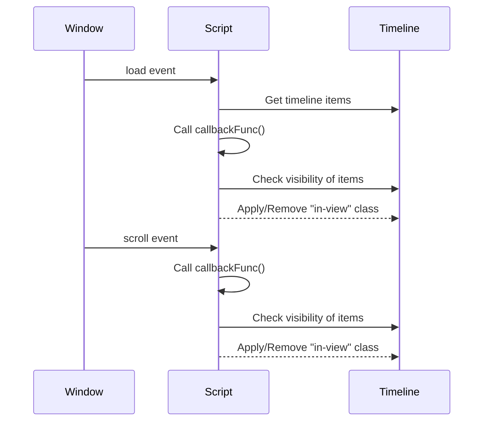

<details>
<summary>Relevant source files</summary>

The following files were used as context for generating this wiki page:

- [js/travels.js](https://github.com/agattani123/agattani123.github.io/blob/master/js/travels.js)

</details>

# Travels Page

## Introduction

The "Travels Page" is a feature within the project that handles the animation of timeline elements on a webpage. It utilizes JavaScript to detect when timeline items come into view and applies CSS classes to trigger animations. This functionality enhances the user experience by providing a visually appealing and dynamic presentation of timeline events.

## Timeline Animation

The core functionality of the "Travels Page" revolves around the animation of timeline items. This section explains the architecture, components, and logic involved in this process.

### Timeline Elements

The timeline items are represented by `<li>` elements within an unordered list (`<ul>`) with the class "timeline". These elements are selected using the `document.querySelectorAll(".timeline li")` method and stored in the `items` variable.

```javascript
var items = document.querySelectorAll(".timeline li");
```

Source: [js/travels.js:1]()

### Viewport Detection

The `isElementInViewport` function determines whether a given element is currently visible within the viewport (the visible area of the browser window). It calculates the element's bounding rectangle using `getBoundingClientRect()` and checks if it intersects with the viewport dimensions.

```javascript
function isElementInViewport(el) {
  var rect = el.getBoundingClientRect();
  return (
    rect.top >= 0 &&
    rect.left >= 0 &&
    rect.bottom <= (window.innerHeight || document.documentElement.clientHeight) &&
    rect.right <= (window.innerWidth || document.documentElement.clientWidth)
  );
}
```

Source: [js/travels.js:3-10]()

### Animation Callback

The `callbackFunc` function is responsible for applying or removing the "in-view" CSS class to timeline items based on their visibility within the viewport. It iterates through the `items` array and checks each item's visibility using the `isElementInViewport` function. If an item is visible, the "in-view" class is added; otherwise, it is removed.

```javascript
function callbackFunc() {
  for (var i = 0; i < items.length; i++) {
    if (isElementInViewport(items[i])) {
      if (!items[i].classList.contains("in-view")) {
        items[i].classList.add("in-view");
      }
    } else if (items[i].classList.contains("in-view")) {
      items[i].classList.remove("in-view");
    }
  }
}
```

Source: [js/travels.js:12-20]()

### Event Listeners

The `callbackFunc` function is executed when the page loads and whenever the user scrolls the window. This is achieved by attaching event listeners to the `window` object for the "load" and "scroll" events.

```javascript
window.addEventListener("load", callbackFunc);
window.addEventListener("scroll", callbackFunc);
```

Source: [js/travels.js:22](), [js/travels.js:23]()

## Data Flow

The data flow for the "Travels Page" animation can be represented by the following sequence diagram:



1. When the page loads, the `load` event is triggered on the `Window` object.
2. The event listener attached to the `load` event calls the `callbackFunc` function.
3. The `callbackFunc` function retrieves the timeline items from the DOM.
4. For each timeline item, the function checks its visibility using the `isElementInViewport` function.
5. Based on the visibility, the "in-view" CSS class is either applied or removed from the timeline item.
6. When the user scrolls the window, the `scroll` event is triggered on the `Window` object.
7. The event listener attached to the `scroll` event calls the `callbackFunc` function.
8. The `callbackFunc` function checks the visibility of the timeline items again and updates the "in-view" CSS class accordingly.

Sources: [js/travels.js:1](), [js/travels.js:3-10](), [js/travels.js:12-20](), [js/travels.js:22](), [js/travels.js:23]()

## Conclusion

The "Travels Page" feature provides a dynamic and visually appealing animation for timeline elements on a webpage. It utilizes JavaScript to detect when timeline items come into view and applies CSS classes to trigger animations. This functionality enhances the user experience by presenting timeline events in an engaging and interactive manner.