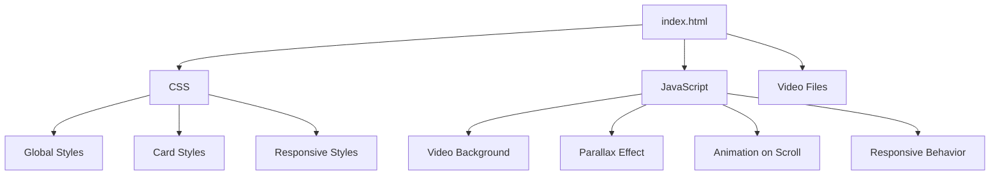
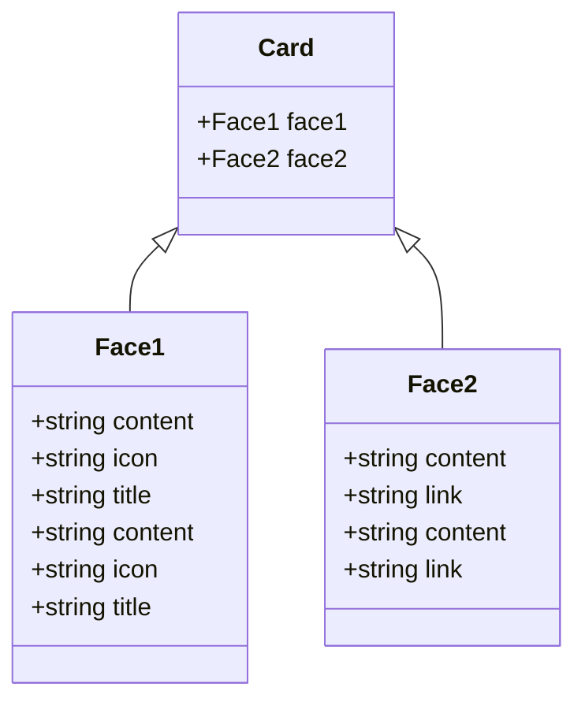

<details>
<summary>Relevant source files</summary>

The following files were used as context for generating this wiki page:

- [css/style.css](https://github.com/agattani123/agattani123.github.io/blob/master/css/style.css)
- [js/main.js](https://github.com/agattani123/agattani123.github.io/blob/master/js/main.js)
- [index.html](https://github.com/agattani123/agattani123.github.io/blob/master/index.html)
- [video/world.mp4](https://github.com/agattani123/agattani123.github.io/blob/master/video/world.mp4)
- [video/world.webm](https://github.com/agattani123/agattani123.github.io/blob/master/video/world.webm)
</details>

# Customization & Theming

## Introduction

The "Customization & Theming" feature in this project refers to the ability to customize the appearance and behavior of various user interface (UI) elements on the website. This includes styling the layout, colors, fonts, and visual effects, as well as controlling the behavior of interactive components like dropdowns and animations. The customization is achieved primarily through CSS styles and JavaScript code.

Sources: [css/style.css](), [js/main.js](), [index.html]()

## CSS Styling

The project utilizes CSS to define the visual styles and layout of the website's components. The `style.css` file contains the majority of the CSS rules and styles.

### Global Styles

The global styles set the default font family, background color, and color scheme for the entire website.

```css
body {
    background: #010001 !important;
    margin: 0;
    padding-top: 53px;
    color: #fff !important;
    font-family: 'Roboto', sans-serif;
}
```

Sources: [css/style.css:2-7]()

### Card Styling

The project includes a custom card component with a hover effect. The card styles are defined using CSS classes and transitions.

```css
.container .card .face.face1 {
    position: relative;
    background: #333;
    display: flex;
    justify-content: center;
    align-content: center;
    align-items: center;
    z-index: 1;
    transform: translateY(100px);
}

.container .card:hover .face.face1, .card:active {
    transform: translateY(0);
    box-shadow: /* ... */;
}
```

Sources: [css/style.css:24-41](), [css/style.css:43-52]()

### Responsive Styles

The project includes media queries to adjust the styles for different screen sizes, ensuring a responsive design.

```css
@media(max-width: 576px) {
    .container .card .face {
        width: 100%;
        display: flex;
        justify-content: center;
        flex-wrap: wrap;
    }
}
```

Sources: [css/style.css:89-96]()

## JavaScript Interactivity

The project utilizes JavaScript to add interactivity and dynamic behavior to the website.

### Video Background

The `vidbg` library is used to create a video background on the website.

```javascript
var instance = new vidbg('.video', {
    mp4: 'video/world.mp4',
    webm: 'video/world.webm',
    poster: 'video/poster.jpg',
    overlay: false,
}, {});
```

Sources: [js/main.js:1-6](), [video/world.mp4](), [video/world.webm]()

### Parallax Effect

The `Rellax` library is used to create a parallax effect for a specific element on the website.

```javascript
var rellax = new Rellax('.rocket');
```

Sources: [js/main.js:8]()

### Animation on Scroll

The `AOS` library is used to add animation effects to elements as they come into view while scrolling.

```javascript
AOS.init();
```

Sources: [js/main.js:10]()

### Responsive Behavior

The project includes a check for the screen size and disables the parallax effect on smaller screens.

```javascript
if (document.body.clientWidth < 576) {
    rellax.destroy();
}
```

Sources: [js/main.js:13-15]()

## Mermaid Diagrams

### Website Structure



This diagram illustrates the overall structure of the website, showing the relationships between the HTML file, CSS styles, JavaScript functionality, and video files used for the video background.

Sources: [index.html](), [css/style.css](), [js/main.js](), [video/world.mp4](), [video/world.webm]()

### Card Component



This class diagram represents the structure of the custom card component used in the project. The `Card` class has two subclasses, `Face1` and `Face2`, which represent the two sides of the card with different content and styles.

Sources: [css/style.css:24-52](), [css/style.css:58-80]()

## Tables

### CSS Styles

| Style | Description |
| --- | --- |
| `body` | Sets the global background color, text color, and font family for the website. |
| `.card` | Defines the styles for the custom card component, including the hover effect and transitions. |
| `@media` | Defines responsive styles for different screen sizes, adjusting the layout and appearance of components. |

Sources: [css/style.css:2-7](), [css/style.css:24-80](), [css/style.css:89-96]()

### JavaScript Functionality

| Function | Description |
| --- | --- |
| `vidbg` | Initializes the video background on the website, using the provided video files and options. |
| `Rellax` | Creates a parallax effect for a specific element on the website. |
| `AOS.init()` | Initializes the Animation on Scroll library, adding animation effects to elements as they come into view while scrolling. |

Sources: [js/main.js:1-6](), [js/main.js:8](), [js/main.js:10]()

## Conclusion

The "Customization & Theming" feature in this project allows for customizing the visual appearance and interactive behavior of the website through CSS styles and JavaScript code. The project includes custom card components with hover effects, responsive design, video background, parallax effects, and animation on scroll. The customization is achieved by modifying the CSS rules and JavaScript functionality based on the project's requirements.

Sources: [css/style.css](), [js/main.js](), [index.html](), [video/world.mp4](), [video/world.webm]()