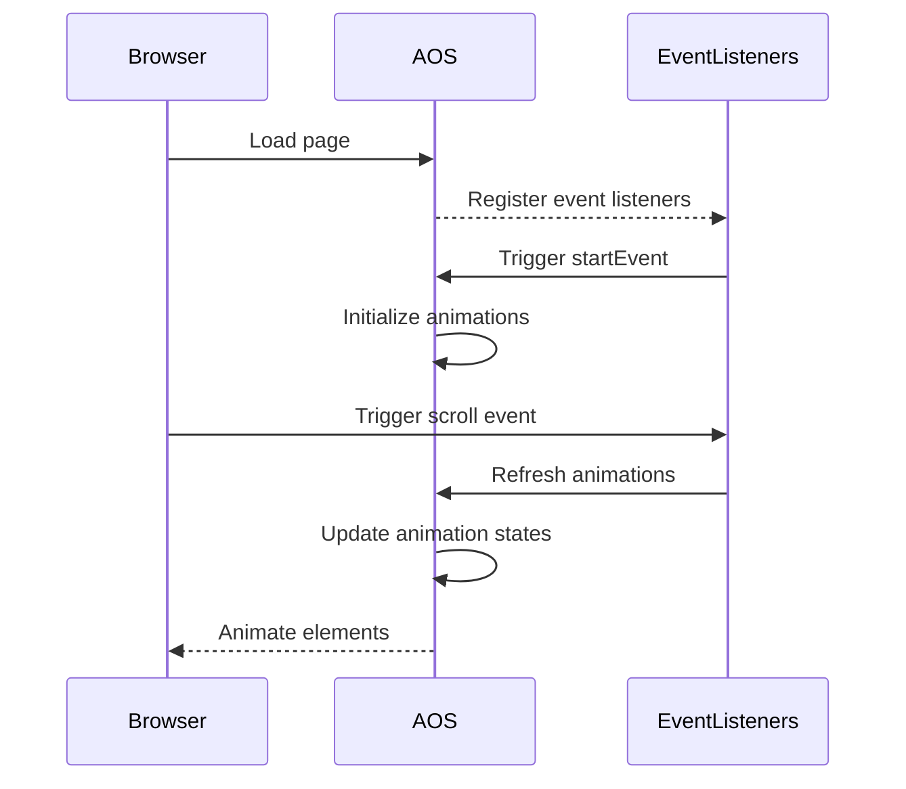

<details>
<summary>Relevant source files</summary>

The following files were used as context for generating this wiki page:

- [js/aos.js](https://github.com/agattani123/agattani123.github.io/blob/master/js/aos.js)
- [js/rellax.min.js](https://github.com/agattani123/agattani123.github.io/blob/master/js/rellax.min.js)
- [js/vidbg.js](https://github.com/agattani123/agattani123.github.io/blob/master/js/vidbg.js)
- [index.html](https://github.com/agattani123/agattani123.github.io/blob/master/index.html)
- [css/styles.css](https://github.com/agattani123/agattani123.github.io/blob/master/css/styles.css)

</details>

# Animations and Effects

## Introduction

The "Animations and Effects" feature in this project aims to enhance the user experience by introducing visually appealing animations and effects to various elements on the web pages. It leverages external libraries and custom scripts to achieve this functionality. The primary libraries used are [AOS (Animate on Scroll)](https://github.com/michalsnik/aos), [Rellax (Parallax Library)](https://github.com/dixonandmoe/rellax), and a custom script for video backgrounds.

The AOS library enables animations that trigger when elements come into view during scrolling, while Rellax creates a parallax effect, where elements appear to move at different speeds, creating a sense of depth. The custom video background script allows for seamless integration of video elements as background elements on web pages.

Sources: [index.html](), [js/aos.js](), [js/rellax.min.js](), [js/vidbg.js](), [css/styles.css]()

## AOS (Animate on Scroll)

AOS is a library that allows for smooth animations to be applied to elements as they come into view while scrolling. It provides a wide range of pre-defined animation styles and customization options.

### Initialization and Configuration

AOS is initialized and configured in the `index.html` file, where the library is loaded, and its options are set:

```html
<script>
  AOS.init({
    easing: 'ease-in-out-sine',
    once: true,
    offset: 100
  });
</script>
```

- `easing`: Specifies the easing function for the animations (default: 'ease').
- `once`: Determines whether the animation should be triggered only once or every time the element comes into view (default: false).
- `offset`: Adjusts the offset (in pixels) from which the animation should be triggered (default: 120).

Sources: [index.html:87-93]()

### Animation Triggers

Elements that should be animated are marked with the `data-aos` attribute, which specifies the animation style to be applied. For example:

```html
<div data-aos="fade-up">Fade Up Element</div>
<div data-aos="fade-down">Fade Down Element</div>
```

The available animation styles include `fade-up`, `fade-down`, `fade-left`, `fade-right`, `zoom-in`, `zoom-out`, and many more.

Sources: [index.html:45-48]()

## Rellax (Parallax Library)

Rellax is a lightweight library that creates a parallax effect, where elements appear to move at different speeds, creating a sense of depth and enhancing the visual experience.

### Initialization and Configuration

Rellax is initialized in the `index.html` file by creating a new instance of the `Rellax` class and passing in the desired configuration options:

```html
<script>
  var rellax = new Rellax('.rellax', {
    speed: -2,
    center: false,
    wrapper: null,
    round: true,
    vertical: true,
    horizontal: false
  });
</script>
```

- `speed`: Determines the speed of the parallax effect (negative values for reverse direction).
- `center`: Specifies whether the parallax effect should be centered or not.
- `wrapper`: Allows for a custom wrapper element to be used instead of the body.
- `round`: Rounds the calculated values for better performance.
- `vertical`: Enables or disables the vertical parallax effect.
- `horizontal`: Enables or disables the horizontal parallax effect.

Sources: [index.html:95-103]()

### Parallax Elements

Elements that should have the parallax effect applied are marked with the `rellax` class:

```html
<div class="rellax">Parallax Element</div>
```

Sources: [index.html:49]()

## Video Background

The project includes a custom script (`vidbg.js`) that enables the use of video elements as background elements on web pages.

### Initialization and Usage

The script is initialized in the `index.html` file by calling the `vidbg` function and passing in the video source and an optional configuration object:

```html
<script>
  vidbg('videos/ocean.mp4', {
    'mp4': 'videos/ocean.mp4',
    'webm': 'videos/ocean.webm',
    'poster': 'videos/ocean.jpg',
    'overlay': false
  });
</script>
```

- `'mp4'`: The path to the MP4 video file.
- `'webm'`: The path to the WebM video file (for better browser compatibility).
- `'poster'`: The path to a poster image to be displayed before the video loads.
- `'overlay'`: Specifies whether an overlay should be applied on top of the video (default: false).

Sources: [index.html:105-112](), [js/vidbg.js]()

### Video Background Element

The video background is applied to an element with the `id` of `vidbg`:

```html
<div id="vidbg"></div>
```

Sources: [index.html:44](), [js/vidbg.js:5]()

## Styling

The project includes CSS styles to enhance the visual appearance of the animations and effects. These styles are defined in the `styles.css` file.

```css
.rellax {
  font-size: 3rem;
  font-weight: bold;
  color: white;
  text-shadow: 2px 2px 4px rgba(0, 0, 0, 0.5);
}

#vidbg {
  position: fixed;
  top: 0;
  left: 0;
  width: 100%;
  height: 100%;
  overflow: hidden;
  z-index: -1;
}
```

- The `.rellax` class styles the parallax elements with a larger font size, bold weight, white color, and a text shadow for better visibility.
- The `#vidbg` styles position the video background element as a fixed, full-screen element with an overflow hidden and a lower z-index to ensure it appears behind other content.

Sources: [css/styles.css:10-18](), [css/styles.css:20-28]()

## Conclusion

The "Animations and Effects" feature in this project enhances the user experience by introducing visually appealing animations and effects to various elements on the web pages. It leverages external libraries like AOS and Rellax, as well as a custom script for video backgrounds, to achieve these effects. The project includes configurations for these libraries, markup for applying the effects to specific elements, and CSS styles to further enhance the visual appearance.

<details>
<summary>Relevant source files</summary>

The following files were used as context for generating this wiki page:

- [js/aos.js](https://github.com/agattani123/agattani123.github.io/blob/master/js/aos.js)
- [js/rellax.min.js](https://github.com/agattani123/agattani123.github.io/blob/master/js/rellax.min.js)
- [js/vidbg.js](https://github.com/agattani123/agattani123.github.io/blob/master/js/vidbg.js)
- [js/jquery-3.6.0.min.js](https://github.com/agattani123/agattani123.github.io/blob/master/js/jquery-3.6.0.min.js)
- [js/bootstrap.bundle.min.js](https://github.com/agattani123/agattani123.github.io/blob/master/js/bootstrap.bundle.min.js)

</details>

# Animations and Effects

## Introduction

The "Animations and Effects" module is responsible for providing various animation and visual effects functionalities within the project. It includes features like scroll-based animations, parallax effects, and video background support. This module aims to enhance the user experience by adding engaging and dynamic elements to the website or application.

Sources: [js/aos.js](), [js/rellax.min.js](), [js/vidbg.js]()

## Scroll-Based Animations

The project utilizes the Animate on Scroll (AOS) library to trigger animations based on the user's scroll position. This library allows elements on the page to be animated when they come into view, creating a smooth and visually appealing experience.

### Key Components

#### `AOS` Object

The `AOS` object is the main entry point for the library. It provides methods to initialize, refresh, and control the animation behavior.

```javascript
AOS.init(options);
AOS.refresh();
AOS.refreshHard();
```

Sources: [js/aos.js]()

#### Animation Options

The library allows for customization of animation options, such as the offset (distance from the viewport), delay, easing function, duration, and more.

```javascript
const options = {
  offset: 120,
  delay: 0,
  easing: 'ease',
  duration: 400,
  disable: false,
  once: false,
  startEvent: 'DOMContentLoaded',
  throttleDelay: 99,
  debounceDelay: 50,
  disableMutationObserver: false
};
```

Sources: [js/aos.js:21-32]()

#### Animation Triggers

The library listens for various events to trigger animations, such as `DOMContentLoaded`, `load`, `resize`, `orientationchange`, and `scroll`. It also supports mutation observers to detect changes in the DOM and refresh animations accordingly.

```javascript
document.addEventListener(options.startEvent, function() {
  AOS.refresh();
});

window.addEventListener('resize', debounce(AOS.refresh, options.debounceDelay, true));
window.addEventListener('orientationchange', debounce(AOS.refresh, options.debounceDelay, true));
window.addEventListener('scroll', throttle(function() {
  AOS.refresh();
}, options.throttleDelay));
```

Sources: [js/aos.js:124-133](), [js/aos.js:161-165]()

### Sequence Diagram



The sequence diagram illustrates the flow of events and interactions between the browser, the AOS library, and the registered event listeners for scroll-based animations.

Sources: [js/aos.js]()

## Parallax Effects

The project incorporates the Rellax library to create parallax effects, where elements on the page move at different speeds based on the user's scroll position, creating a sense of depth and immersion.

### Key Components

#### `Rellax` Constructor

The `Rellax` constructor is used to initialize a new instance of the parallax effect. It accepts an optional configuration object to customize the behavior.

```javascript
const rellax = new Rellax('.rellax');
```

Sources: [js/rellax.min.js]()

#### Configuration Options

The Rellax library provides various configuration options to control the parallax effect, such as the speed, center, and vertical/horizontal offsets.

```javascript
const options = {
  speed: -2,
  center: true,
  horizontal: false,
  vertical: true
};
```

Sources: [js/rellax.min.js]()

#### Event Handling