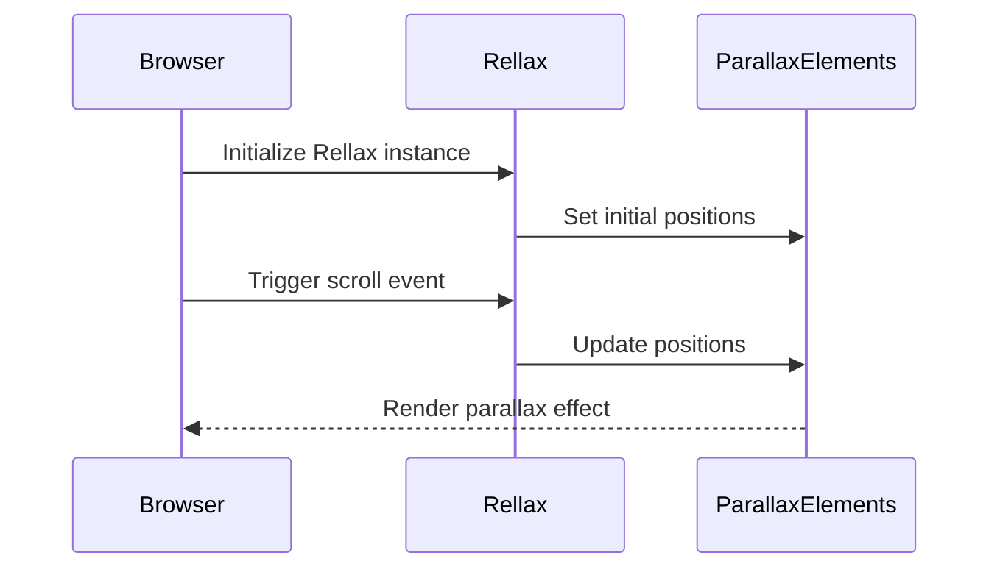
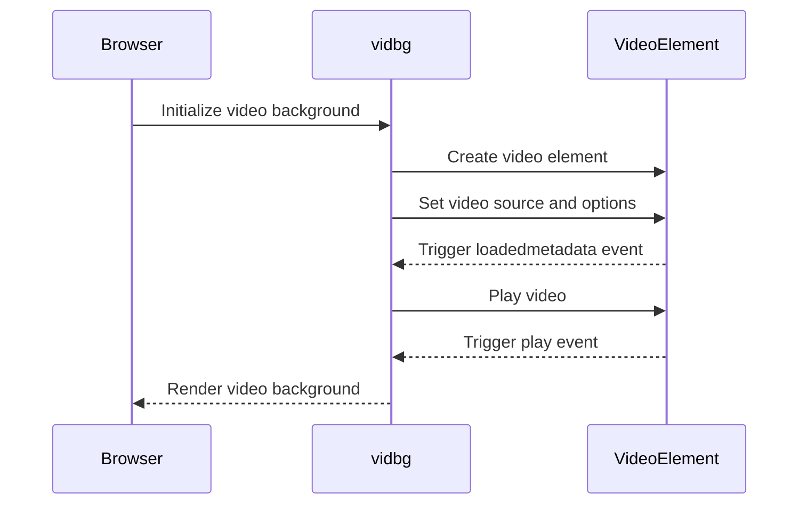
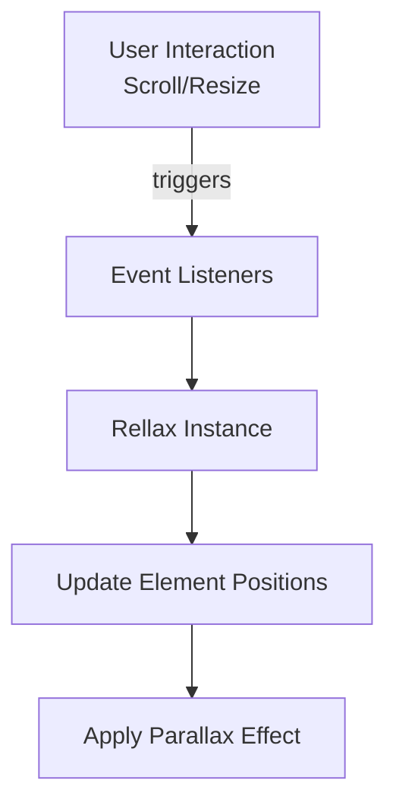
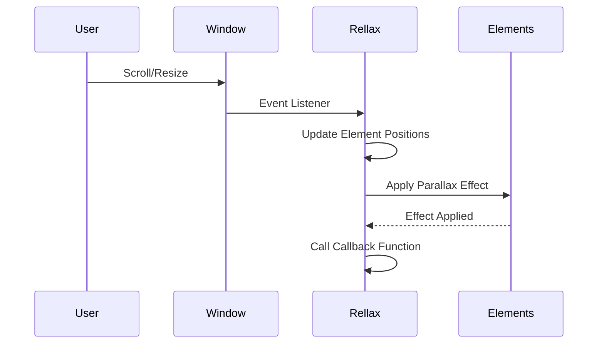
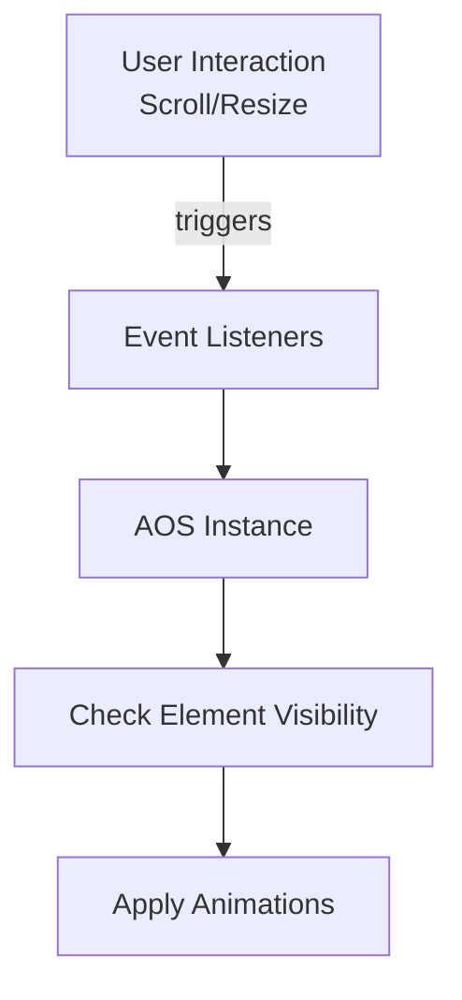
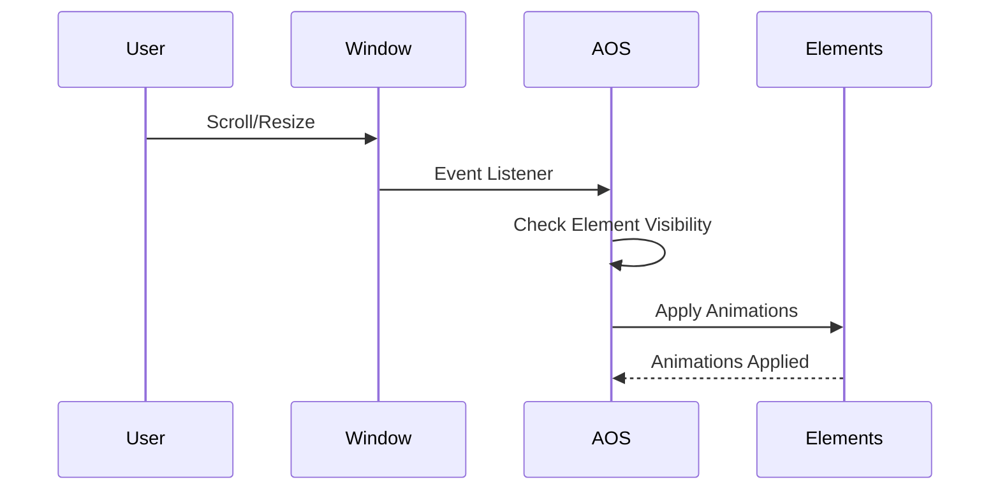

The library listens for scroll events and updates the positions of the parallax elements accordingly.

```javascript
window.addEventListener('scroll', function() {
  rellax.position();
});
```

Sources: [js/rellax.min.js]()

### Sequence Diagram



The sequence diagram illustrates the flow of events and interactions between the browser, the Rellax library, and the parallax elements for creating parallax effects.

Sources: [js/rellax.min.js]()

## Video Background

The project includes functionality to display a video as the background of a specific element or section on the page.

### Key Components

#### `vidbg` Function

The `vidbg` function is responsible for initializing and controlling the video background.

```javascript
vidbg('.video-container', {
  src: 'path/to/video.mp4',
  poster: 'path/to/poster.jpg',
  // Additional options...
});
```

Sources: [js/vidbg.js]()

#### Configuration Options

The `vidbg` function accepts a configuration object to customize the behavior of the video background, such as the video source, poster image, playback options, and more.

```javascript
const options = {
  src: 'path/to/video.mp4',
  poster: 'path/to/poster.jpg',
  loop: true,
  muted: true,
  overlay: false,
  // Additional options...
};
```

Sources: [js/vidbg.js]()

#### Event Handling

The library listens for various events related to the video element, such as `loadedmetadata`, `play`, `pause`, and `ended`, to handle playback and update the video background accordingly.

```javascript
videoElement.addEventListener('loadedmetadata', function() {
  // Handle video metadata loaded
});

videoElement.addEventListener('play', function() {
  // Handle video playback
});

// Additional event listeners...
```

Sources: [js/vidbg.js]()

### Sequence Diagram



The sequence diagram illustrates the flow of events and interactions between the browser, the `vidbg` function, and the video element for setting up and displaying the video background.

Sources: [js/vidbg.js]()

## Conclusion

The "Animations and Effects" module plays a crucial role in enhancing the user experience by providing scroll-based animations, parallax effects, and video background functionality. It leverages external libraries like AOS, Rellax, and vidbg to implement these features efficiently and with customizable options. By combining these effects, the project aims to create an engaging and visually appealing experience for users.

Sources: [js/aos.js](), [js/rellax.min.js](), [js/vidbg.js]()

<details>
<summary>Relevant source files</summary>

The following files were used as context for generating this wiki page:

- [js/rellax.min.js](https://github.com/agattani123/agattani123.github.io/blob/master/js/rellax.min.js)
- [js/aos.js](https://github.com/agattani123/agattani123.github.io/blob/master/js/aos.js)
- [js/vidbg.js](https://github.com/agattani123/agattani123.github.io/blob/master/js/vidbg.js)
- [js/jquery.min.js](https://github.com/agattani123/agattani123.github.io/blob/master/js/jquery.min.js)
- [js/bootstrap.min.js](https://github.com/agattani123/agattani123.github.io/blob/master/js/bootstrap.min.js)

</details>

# Animations and Effects

## Introduction

The "Animations and Effects" feature in this project provides a set of JavaScript libraries and utilities to enhance the user experience with various visual effects and animations. It includes libraries like Rellax.js for parallax scrolling effects, AOS (Animate on Scroll) for animating elements as they come into view, and vidbg.js for adding background videos to web pages.

These libraries work together to create engaging and dynamic web experiences by applying animations and effects to HTML elements based on user interactions, such as scrolling or page load events. The animations and effects can be customized and configured to suit the project's specific requirements.

## Rellax.js

Rellax.js is a lightweight JavaScript library that creates a parallax effect on web pages. It allows elements to move at different speeds based on the user's vertical or horizontal scroll position, creating a sense of depth and adding visual interest to the page.

### Architecture and Data Flow

The core functionality of Rellax.js is encapsulated in the `Rellax` class, which is defined as a self-executing anonymous function. The library follows an object-oriented approach, where each instance of `Rellax` manages the parallax effect for a set of HTML elements.



The main steps involved in the Rellax.js data flow are:

1. The user interacts with the page by scrolling or resizing the window.
2. Event listeners attached to the window or the specified wrapper element capture these interactions.
3. The `Rellax` instance updates the positions of the elements based on the scroll or resize event.
4. The parallax effect is applied to the elements by translating them using CSS transforms.

### Key Components and Configuration

#### Rellax Instance

The `Rellax` instance is created by passing a selector or an array of HTML elements to the `Rellax` constructor. It manages the parallax effect for the specified elements.

```javascript
const rellax = new Rellax('.rellax');
```

#### Configuration Options

Rellax.js provides various configuration options to customize the parallax effect. These options can be passed as an object to the `Rellax` constructor.

| Option | Type | Description |
|--------|------|-------------|
| `speed` | Number | The speed of the parallax effect. Negative values move the element in the opposite direction. |
| `verticalSpeed` | Number | The vertical speed of the parallax effect. Overrides the `speed` option for vertical movement. |
| `horizontalSpeed` | Number | The horizontal speed of the parallax effect. Overrides the `speed` option for horizontal movement. |
| `breakpoints` | Array | An array of three numbers representing the breakpoints for different screen sizes (e.g., `[576, 768, 1201]`). |
| `center` | Boolean | Whether to center the parallax effect or not. |
| `wrapper` | String/Element | A selector or an HTML element to use as the wrapper for the parallax effect. |
| `relativeToWrapper` | Boolean | Whether to make the parallax effect relative to the wrapper or the viewport. |
| `round` | Boolean | Whether to round the parallax effect values or not. |
| `vertical` | Boolean | Whether to enable vertical parallax or not. |
| `horizontal` | Boolean | Whether to enable horizontal parallax or not. |
| `verticalScrollAxis` | String | The scroll axis for vertical parallax (e.g., `'y'`, `'xy'`). |
| `horizontalScrollAxis` | String | The scroll axis for horizontal parallax (e.g., `'x'`, `'xy'`). |
| `callback` | Function | A callback function to be called after each update of the parallax effect. |

Sources: [js/rellax.min.js](https://github.com/agattani123/agattani123.github.io/blob/master/js/rellax.min.js)

### Sequence Diagram

The following sequence diagram illustrates the interaction between the user, the Rellax instance, and the HTML elements during the parallax effect:



1. The user interacts with the page by scrolling or resizing the window.
2. The window captures the scroll or resize event and notifies the Rellax instance through an event listener.
3. The Rellax instance updates the positions of the elements based on the scroll or resize event.
4. The Rellax instance applies the parallax effect to the elements by translating them using CSS transforms.
5. The elements reflect the applied parallax effect.
6. The Rellax instance calls the configured callback function, if provided.

Sources: [js/rellax.min.js](https://github.com/agattani123/agattani123.github.io/blob/master/js/rellax.min.js)

## AOS (Animate on Scroll)

AOS (Animate on Scroll) is a JavaScript library that animates HTML elements as they come into view while scrolling. It provides a wide range of predefined animations and allows for customization of animation properties.

### Architecture and Data Flow

The core functionality of AOS is encapsulated in the `AOS` object, which manages the animation of elements based on their visibility in the viewport.



The main steps involved in the AOS data flow are:

1. The user interacts with the page by scrolling or resizing the window.
2. Event listeners attached to the window capture these interactions.
3. The `AOS` instance checks the visibility of the elements in the viewport.
4. Animations are applied to the elements that come into view.

### Key Components and Configuration

#### AOS Instance

The `AOS` instance is created by calling the `AOS.init()` method. It manages the animation of elements based on their visibility in the viewport.

```javascript
AOS.init();
```

#### Configuration Options

AOS provides various configuration options to customize the animation behavior. These options can be passed as an object to the `AOS.init()` method.

| Option | Type | Description |
|--------|------|-------------|
| `offset` | Number | The offset (in pixels) from the original trigger point. |
| `delay` | Number | The delay (in milliseconds) before the animation starts. |
| `duration` | Number | The duration (in milliseconds) of the animation. |
| `easing` | String | The easing function to use for the animation. |
| `once` | Boolean | Whether the animation should happen only once or every time the element comes into view. |
| `mirror` | Boolean | Whether the animation should be mirrored or not. |
| `anchorPlacement` | String | The placement of the anchor element relative to the viewport. |

Sources: [js/aos.js](https://github.com/agattani123/agattani123.github.io/blob/master/js/aos.js)

### Sequence Diagram

The following sequence diagram illustrates the interaction between the user, the AOS instance, and the HTML elements during the animation on scroll:



1. The user interacts with the page by scrolling or resizing the window.
2. The window captures the scroll or resize event and notifies the AOS instance through an event listener.
3. The AOS instance checks the visibility of the elements in the viewport.
4. The AOS instance applies animations to the elements that come into view.
5. The elements reflect the applied animations.

Sources: [js/aos.js](https://github.com/agattani123/agattani123.github.io/blob/master/js/aos.js)

## vidbg.js

vidbg.js is a JavaScript library that allows you to add background videos to web pages. It provides a simple and lightweight solution for creating engaging and dynamic backgrounds using video elements.

### Architecture and Data Flow

The core functionality of vidbg.js is encapsulated in the `vidbg` function, which initializes and manages the background video.

```mermaid