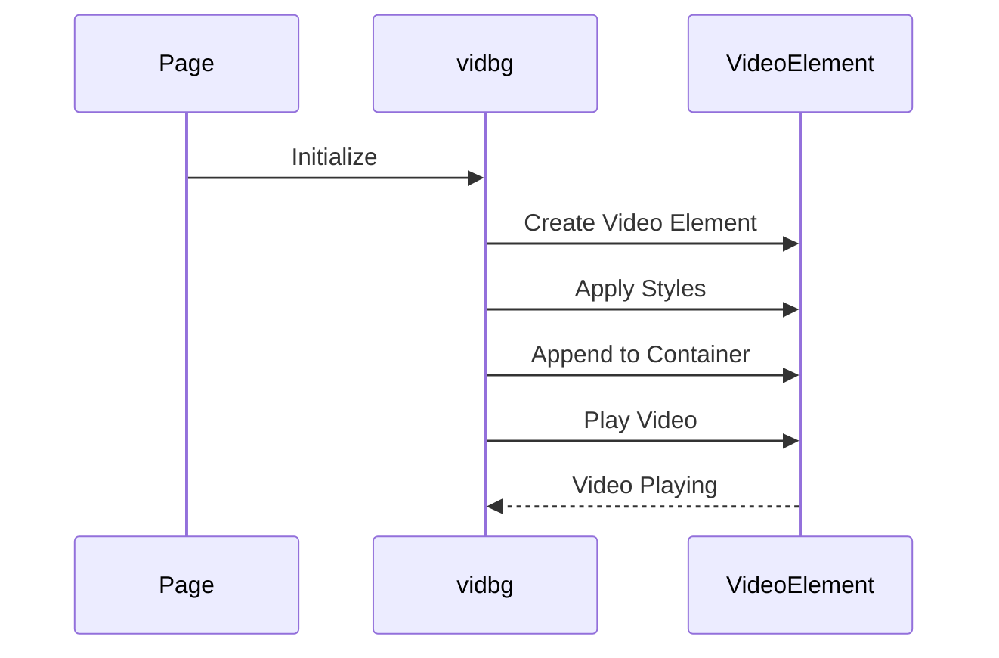
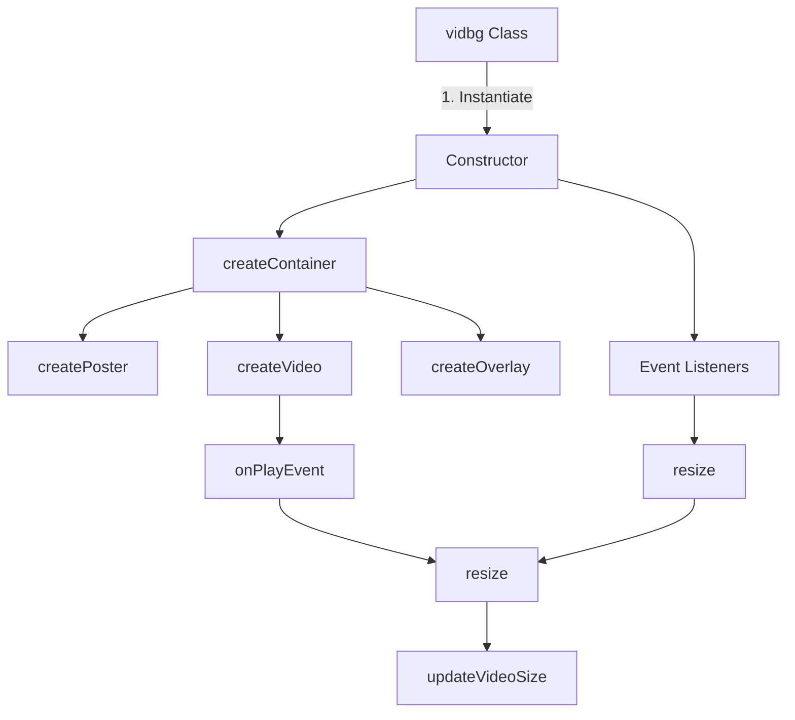

graph TD
    A[Page Load] -->|triggers| B[vidbg Function]
    B --> C[Initialize Video Element]
    C --> D[Apply Video Styles]
    D --> E[Append Video to Container]
    E --> F[Play Video]
```

The main steps involved in the vidbg.js data flow are:

1. The page loads, triggering the `vidbg` function.
2. The `vidbg` function initializes a video element.
3. Styles are applied to the video element to make it a background video.
4. The video element is appended to the specified container element.
5. The video starts playing automatically.

### Key Components and Configuration

#### vidbg Function

The `vidbg` function is the entry point for initializing and managing the background video. It takes an options object as a parameter to configure the behavior of the video.

```javascript
vidbg('path/to/video.mp4', {
  // Options
});
```

#### Configuration Options

vidbg.js provides various configuration options to customize the behavior of the background video. These options can be passed as an object to the `vidbg` function.

| Option | Type | Description |
|--------|------|-------------|
| `poster` | String | The path to the poster image to be displayed before the video loads. |
| `webm` | String | The path to the WebM version of the video for better browser support. |
| `mp4` | String | The path to the MP4 version of the video. |
| `container` | String/Element | A selector or an HTML element to use as the container for the video. |
| `overlay` | Boolean | Whether to add an overlay element on top of the video. |
| `fill` | Boolean | Whether to stretch the video to fill the container or maintain its aspect ratio. |
| `pauseOnBlur` | Boolean | Whether to pause the video when the window loses focus. |
| `pauseOnBlurMobile` | Boolean | Whether to pause the video on mobile devices when the window loses focus. |

Sources: [js/vidbg.js](https://github.com/agattani123/agattani123.github.io/blob/master/js/vidbg.js)

### Sequence Diagram

The following sequence diagram illustrates the interaction between the page, the vidbg function, and the video element during the initialization and playback of the background video:



1. The page triggers the initialization of the vidbg function.
2. The vidbg function creates a new video element.
3. The vidbg function applies styles to the video element to make it a background video.
4. The vidbg function appends the video element to the specified container.
5. The vidbg function starts playing the video.
6. The video element notifies the vidbg function that the video is playing.

Sources: [js/vidbg.js](https://github.com/agattani123/agattani123.github.io/blob/master/js/vidbg.js)

## Conclusion

The "Animations and Effects" feature in this project provides a comprehensive set of JavaScript libraries and utilities to enhance the user experience with various visual effects and animations. Rellax.js enables parallax scrolling effects, AOS (Animate on Scroll) animates elements as they come into view, and vidbg.js allows for the addition of background videos to web pages.

These libraries work together to create engaging and dynamic web experiences, adding depth and visual interest to the project. By leveraging these libraries, developers can easily incorporate animations and effects into their web applications, improving the overall user experience and creating a more immersive and captivating interface.

<details>
<summary>Relevant source files</summary>

The following files were used as context for generating this wiki page:

- [js/vidbg.js](https://github.com/agattani123/agattani123.github.io/blob/master/js/vidbg.js)
- [js/aos.js](https://github.com/agattani123/agattani123.github.io/blob/master/js/aos.js)
- [js/rellax.min.js](https://github.com/agattani123/agattani123.github.io/blob/master/js/rellax.min.js)
- [css/aos.css](https://github.com/agattani123/agattani123.github.io/blob/master/css/aos.css)
- [css/rellax.css](https://github.com/agattani123/agattani123.github.io/blob/master/css/rellax.css)

</details>

# Animations and Effects

## Introduction

The "Animations and Effects" feature in this project provides various visual enhancements to enhance the user experience. It includes functionality for adding background videos, overlays, and animations to elements on the web page. The primary components involved are:

- **vidbg.js**: A library for creating a full-screen background video with an optional overlay.
- **AOS (Animate on Scroll) Library**: A library for adding scroll-based animations to elements on the page.
- **Rellax.js**: A library for creating a parallax effect, where elements move at different speeds as the user scrolls.

These components work together to create an immersive and engaging experience for the user, with smooth animations, video backgrounds, and parallax effects.

Sources: [js/vidbg.js](), [js/aos.js](), [js/rellax.min.js](), [css/aos.css](), [css/rellax.css]()

## Background Video and Overlay

The `vidbg.js` library is responsible for creating a full-screen background video with an optional overlay. It provides a `vidbg` class that can be initialized with various options.

### Architecture and Data Flow



1. The `vidbg` class is instantiated with options such as video sources (MP4, WebM), poster image, and overlay settings.
2. The constructor sets up the necessary properties and calls helper methods to create the video container, video element, poster image, and overlay.
3. The `createVideo` method creates the `<video>` element, appends video sources, and adds event listeners.
4. The `onPlayEvent` handler is triggered when the video starts playing, updating the video's opacity and calling the `resize` method.
5. The `resize` method adjusts the video size to maintain aspect ratio and fill the container.
6. Event listeners are set up to handle window resize events and update the video size accordingly.

Sources: [js/vidbg.js:1-265]()

### Key Components and Configuration

| Component | Description |
| --- | --- |
| `vidbg` Class | The main class for creating a background video with an overlay. |
| `options` Object | Configures the video sources, poster image, and overlay settings. |
| `attributes` Object | Sets attributes for the `<video>` element, such as controls, loop, muted, and playsinline. |

Sources: [js/vidbg.js:1-265]()

### Overlay Configuration

The overlay is created using the `createOverlay` method, which generates a `<div>` element with the class `vidbg-overlay`. The overlay color and opacity can be configured through the `options` object:

```javascript
this.options = {
    // ...
    overlay: true, // Enable overlay
    overlayColor: '#000', // Overlay color (hex code)
    overlayAlpha: 0.3 // Overlay opacity (0-1)
};
```

The overlay element's background color is set using the `overlayColor` and `overlayAlpha` options, converted to an RGBA value.

Sources: [js/vidbg.js:69-79]()

## Animate on Scroll (AOS) Library

The AOS (Animate on Scroll) Library is used to add scroll-based animations to elements on the web page. It provides a simple way to animate elements as they come into view while scrolling.

### Usage and Configuration

To use AOS, elements need to be marked with the `data-aos` attribute, specifying the animation type. Additional options can be set using `data-aos-*` attributes or through global configuration.

```html
<div data-aos="fade-up" data-aos-duration="1000">Animated Element</div>
```

The global configuration can be set in JavaScript:

```javascript
AOS.init({
    offset: 120, // Offset (in px) from the original trigger point
    delay: 0, // Values from 0 to 3000, with step 50ms
    duration: 400, // Values from 0 to 3000, with step 50ms
    easing: 'ease', // Default easing for AOS animations
    once: false, // Whether animation should happen only once
    mirror: false, // Whether elements should animate out while scrolling past them
    anchorPlacement: 'top-bottom' // Defines which position of the element regarding to window should trigger the animation
});
```

Sources: [js/aos.js](), [css/aos.css]()

### Animation Types

AOS provides various animation types that can be specified using the `data-aos` attribute. Some examples include:

- `fade-up`: Fades in and moves the element up.
- `fade-down`: Fades in and moves the element down.
- `fade-left`: Fades in and moves the element from the left.
- `fade-right`: Fades in and moves the element from the right.
- `zoom-in`: Zooms in the element.
- `zoom-out`: Zooms out the element.

Sources: [css/aos.css]()

## Rellax.js Parallax Effect

The Rellax.js library is used to create a parallax effect, where elements move at different speeds as the user scrolls. This creates a sense of depth and adds visual interest to the page.

### Usage and Configuration

To use Rellax.js, elements need to be marked with the `data-rellax-*` attributes, specifying the parallax behavior. Additional options can be set through global configuration.

```html
<div data-rellax-speed="2">Parallax Element</div>
```

The global configuration can be set in JavaScript:

```javascript
var rellax = new Rellax('.rellax', {
    center: true, // Whether the element should be centered within its container
    horizontal: false, // Whether the element should move horizontally
    vertical: true, // Whether the element should move vertically
    speed: -2, // The speed at which the element moves
    zindex: true, // Whether the element should maintain its z-index position
    wrapper: null, // The parent element to use as a positioning wrapper
    round: true, // Whether the element's movement should be rounded
    callback: function(position) { // A callback function to execute on each position change
        // ...
    }
});
```

Sources: [js/rellax.min.js](), [css/rellax.css]()

### Parallax Speed

The `data-rellax-speed` attribute controls the speed at which an element moves relative to the scroll position. Positive values make the element move slower than the scroll, while negative values make it move faster.

```html
<div data-rellax-speed="2">Moves slower than scroll</div>
<div data-rellax-speed="-2">Moves faster than scroll</div>
```

Sources: [js/rellax.min.js](), [css/rellax.css]()

## Conclusion

The "Animations and Effects" feature in this project enhances the user experience by providing background videos, overlays, scroll-based animations, and parallax effects. The `vidbg.js` library creates a full-screen background video with an optional overlay, while the AOS library adds scroll-based animations to elements. The Rellax.js library creates a parallax effect, where elements move at different speeds as the user scrolls. These components work together to create an immersive and visually appealing experience for the user.