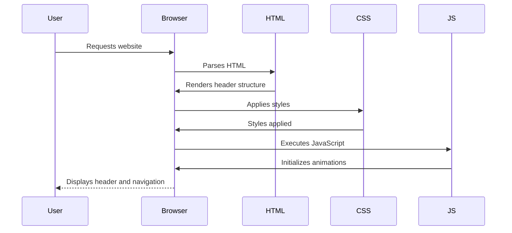

<details>
<summary>Relevant source files</summary>

The following files were used as context for generating this wiki page:

- [index.html](https://github.com/agattani123/agattani123.github.io/blob/master/index.html)
- [css/style.css](https://github.com/agattani123/agattani123.github.io/blob/master/css/style.css)
- [css/vidbg.css](https://github.com/agattani123/agattani123.github.io/blob/master/css/vidbg.css)
- [css/aos.css](https://github.com/agattani123/agattani123.github.io/blob/master/css/aos.css)
- [js/vidbg.js](https://github.com/agattani123/agattani123.github.io/blob/master/js/vidbg.js)
- [js/rellax.min.js](https://github.com/agattani123/agattani123.github.io/blob/master/js/rellax.min.js)
- [js/aos.js](https://github.com/agattani123/agattani123.github.io/blob/master/js/aos.js)
- [js/main.js](https://github.com/agattani123/agattani123.github.io/blob/master/js/main.js)
- [js/script.js](https://github.com/agattani123/agattani123.github.io/blob/master/js/script.js)
- [js/type.js](https://github.com/agattani123/agattani123.github.io/blob/master/js/type.js)

</details>

# Header & Navigation

## Introduction

The "Header & Navigation" component is a crucial part of the website, providing a consistent and user-friendly way for visitors to navigate through different sections and access important information. It serves as the primary entry point and acts as a central hub for navigating the site's content.

The header consists of a logo, two navigation menus, and links to external resources such as a resume and contact information. The main navigation menu allows users to access the "About", "Education", "Projects", and "Travel" sections of the website. The secondary navigation menu provides direct links to contact the website owner and download their resume.

Sources: [index.html](https://github.com/agattani123/agattani123.github.io/blob/master/index.html:12-43), [css/style.css](https://github.com/agattani123/agattani123.github.io/blob/master/css/style.css:1-320)

## Header Structure

The header is implemented as an HTML `<header>` element with the class `header`. It contains the following main components:

```html
<header class="header">
    
    <nav class="main-nav" data-aos="fade-down">
        <!-- Main navigation menu -->
    </nav>
    <nav class="second-nav" data-aos="fade-down">
        <!-- Secondary navigation menu -->
    </nav>
</header>
```

Sources: [index.html:12-22](https://github.com/agattani123/agattani123.github.io/blob/master/index.html:12-22)

### Logo

The website logo is an image element (``) with the class `logo`. It is displayed at the top-left corner of the header and has a fade-down animation effect applied using the `data-aos` attribute.

```html

```

Sources: [index.html:13](https://github.com/agattani123/agattani123.github.io/blob/master/index.html:13)

### Main Navigation Menu

The main navigation menu is implemented as an unordered list (`<ul>`) with the class `list` inside a `<nav>` element with the class `main-nav`. Each menu item is represented by an `<li>` element with the class `item`, containing a link (`<a>`) with the class `item-link`.

```html
<nav class="main-nav" data-aos="fade-down">
    <ul class="list">
        <li class="item"><a href="index.html" class="item-link">About</a></li>
        <li class="item"><a href="#" class="item-link" id="education-link">Education</a></li>
        <li class="item"><a href="#" class="item-link" id="projects-link">Projects</a></li>
        <li class="item"><a href="travels.html" class="item-link">Travel</a></li>
    </ul>
</nav>
```

Sources: [index.html:14-19](https://github.com/agattani123/agattani123.github.io/blob/master/index.html:14-19)

### Secondary Navigation Menu

The secondary navigation menu is also implemented as an unordered list (`<ul>`) with the class `list` inside a `<nav>` element with the class `second-nav`. It contains links for contacting the website owner and downloading their resume.

```html
<nav class="second-nav" data-aos="fade-down">
    <ul class="list">
        <li class="item"><a href="mailto:agattani@seas.upenn.edu" class="item-link">Contact</a></li>
        <li class="item"><a href="Arnav_Gattani_Resume.pdf" class="item-link">Resume</a></li>
    </ul>
</nav>
```

Sources: [index.html:20-22](https://github.com/agattani123/agattani123.github.io/blob/master/index.html:20-22)

## Styling

The styling for the header and navigation menus is defined in the `css/style.css` file.

### Header Styles

The header is styled with a maximum width of `1230px` and a width of `90%` of the viewport, centered horizontally using `margin: 0 auto`. It is displayed as a flex container with the items spaced between using `justify-content: space-between`.

```css
.header {
    max-width: 1230px;
    width: 90%;
    margin: 0 auto;
    display: flex;
    justify-content: space-between;
}
```

Sources: [css/style.css:23-29](https://github.com/agattani123/agattani123.github.io/blob/master/css/style.css:23-29)

### Navigation Menu Styles

The navigation menus are styled as unordered lists (`<ul>`) with no bullet points (`list-style: none`). The menu items are displayed horizontally using `display: flex`.

```css
.list {
    margin: 0;
    padding: 0;
    display: flex;
    list-style: none;
}
```

The links within the menu items are styled with a white color (`#FFFFFF`) for the main navigation menu and a gray color (`#808080`) for the secondary navigation menu. They have a margin of `10px` on the left and right sides, a font size of `12px`, and a line height of `14px`.

```css
.item-link {
    color: #FFFFFF;
    text-decoration: none;
    margin-left: 10px;
    margin-right: 10px;
    font-size: 12px;
    line-height: 14px;
}

.second-nav .item-link {
    color: #808080;
}
```

Sources: [css/style.css:30-43](https://github.com/agattani123/agattani123.github.io/blob/master/css/style.css:30-43)

### Responsive Styles

The CSS file includes media queries to adjust the layout and styles for smaller screen sizes.

For screens with a maximum width of `768px`, the header is displayed as a flex column with the logo, main navigation menu, and secondary navigation menu stacked vertically. The logo is hidden by setting its `width` and `height` to `1px`.

```css
@media(max-width: 768px) {
    .header {
        flex-direction: column;
        align-items: center;
    }

    .header .logo {
        margin-bottom: 2px;
        width: 1px;
        height: 1px; 
    }

    .header .main-nav {
        margin-bottom: 20px;
    }
}
```

For screens with a maximum width of `576px`, the footer navigation menu items are wrapped and centered using `flex-wrap: wrap` and `justify-content: center`.

```css
@media(max-width: 576px) {
    .footer .footer-nav .list {
        flex-wrap: wrap;
        align-items: center;
        justify-content: center;
    }

    .footer .footer-nav .item {
        margin-bottom: 10px;
    }
}
```

Sources: [css/style.css:272-293](https://github.com/agattani123/agattani123.github.io/blob/master/css/style.css:272-293)

## Animations

The header and navigation menus have a fade-down animation effect applied using the `data-aos` attribute and the `aos.css` and `aos.js` files.

```html

<nav class="main-nav" data-aos="fade-down">
    <!-- ... -->
</nav>
<nav class="second-nav" data-aos="fade-down">
    <!-- ... -->
</nav>
```

The `aos.css` file defines the CSS styles for the animation effects, and the `aos.js` file provides the JavaScript functionality to trigger the animations.

Sources: [index.html:13-22](https://github.com/agattani123/agattani123.github.io/blob/master/index.html:13-22), [css/aos.css](https://github.com/agattani123/agattani123.github.io/blob/master/css/aos.css), [js/aos.js](https://github.com/agattani123/agattani123.github.io/blob/master/js/aos.js)

## Sequence Diagram

The following sequence diagram illustrates the interaction between the user, the browser, and the various components involved in rendering the header and navigation menus:



1. The user requests the website in their browser.
2. The browser parses the HTML file (`index.html`) and renders the header structure, including the logo, main navigation menu, and secondary navigation menu.
3. The browser applies the styles defined in the `css/style.css` file to the header and navigation elements.
4. The browser executes the JavaScript files (`aos.js`, `main.js`, `script.js`, `type.js`) to initialize animations and other interactive features.
5. The browser displays the fully rendered header and navigation menus to the user.

Sources: [index.html](https://github.com/agattani123/agattani123.github.io/blob/master/index.html), [css/style.css](https://github.com/agattani123/agattani123.github.io/blob/master/css/style.css), [js/aos.js](https://github.com/agattani123/agattani123.github.io/blob/master/js/aos.js), [js/main.js](https://github.com/agattani123/agattani123.github.io/blob/master/js/main.js), [js/script.js](https://github.com/agattani123/agattani123.github.io/blob/master/js/script.js), [js/type.js](https://github.com/agattani123/agattani123.github.io/blob/master/js/type.js)

## Summary

The "Header & Navigation" component plays a crucial role in providing a consistent and user-friendly navigation experience throughout the website. It consists of a logo, a main navigation menu for accessing different sections, and a secondary navigation menu for contacting the website owner and downloading their resume. The header and navigation menus are styled using CSS and enhanced with animations using JavaScript and the AOS library. Responsive styles are also included to ensure a seamless experience across different screen sizes.