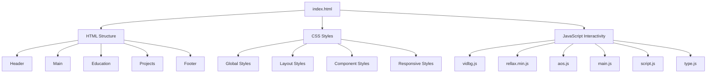
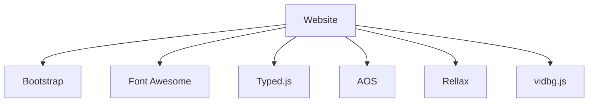

Relevant source files

- [index.html](https://github.com/agattani123/agattani123.github.io/blob/master/index.html)
- [js/main.js](https://github.com/agattani123/agattani123.github.io/blob/master/js/main.js)
- [css/style.css](https://github.com/agattani123/agattani123.github.io/blob/master/css/style.css)
- [js/vidbg.js](https://github.com/agattani123/agattani123.github.io/blob/master/js/vidbg.js)
- [js/type.js](https://github.com/agattani123/agattani123.github.io/blob/master/js/type.js)

# Architecture Overview

## Introduction

This project is a personal portfolio website for Arnav Gattani, a computer science and physics student at the University of Pennsylvania. The website showcases Arnav's education, projects, and travel experiences. It is built using HTML, CSS, JavaScript, and various libraries and frameworks.

The website follows a modern and responsive design, with a video background and interactive elements. The architecture is based on a client-side rendering approach, where the HTML, CSS, and JavaScript files are loaded and executed in the user's browser.

Sources: [index.html](https://github.com/agattani123/agattani123.github.io/blob/master/index.html), [js/main.js](https://github.com/agattani123/agattani123.github.io/blob/master/js/main.js), [css/style.css](https://github.com/agattani123/agattani123.github.io/blob/master/css/style.css)

## Front-end Architecture

### HTML Structure

The website's structure is defined in the `index.html` file, which contains the following main sections:

1. **Header**: Includes the logo, navigation menus, and links to external resources like the resume.
2. **Main**: Displays the title and a brief description of Arnav.
3. **Education**: Provides details about Arnav's educational background, coursework, and teaching assistant roles.
4. **Projects**: Showcases various projects Arnav has worked on, with descriptions, links, and interactive card elements.
5. **Footer**: Contains social media links and a contact email address.

Sources: [index.html](https://github.com/agattani123/agattani123.github.io/blob/master/index.html)

### CSS Styling

The website's visual styles are defined in the `style.css` file, which includes:

- **Global Styles**: Defines the overall look and feel, including colors, fonts, and background.
- **Layout Styles**: Handles the positioning and layout of various elements using Flexbox and other CSS techniques.
- **Component Styles**: Styles specific components like the header, navigation, cards, and dropdowns.
- **Responsive Styles**: Media queries to ensure a consistent experience across different screen sizes.

Sources: [css/style.css](https://github.com/agattani123/agattani123.github.io/blob/master/css/style.css)

### JavaScript Interactivity

The website's interactivity is powered by various JavaScript files and libraries:

1. **vidbg.js**: Handles the video background functionality, loading and playing the video seamlessly.
2. **rellax.min.js**: Provides a parallax effect for certain elements on the page.
3. **aos.js**: Implements the "Animate on Scroll" library for smooth animations as elements come into view.
4. **main.js**: Initializes and configures the vidbg, rellax, and AOS libraries. It also handles responsive behavior for the parallax effect.
5. **script.js**: Handles the interactive card flip effect for the project cards.
6. **type.js**: Utilizes the Typed.js library to create an auto-typing effect for the section headings.

Sources: [js/main.js](https://github.com/agattani123/agattani123.github.io/blob/master/js/main.js), [js/vidbg.js](https://github.com/agattani123/agattani123.github.io/blob/master/js/vidbg.js), [js/type.js](https://github.com/agattani123/agattani123.github.io/blob/master/js/type.js)

The website's architecture follows a modular approach, separating concerns between HTML structure, CSS styling, and JavaScript functionality. The HTML file serves as the entry point, loading the necessary CSS and JavaScript files. The CSS file defines the visual styles, while the JavaScript files handle interactivity, animations, and effects.

Sources: [index.html](https://github.com/agattani123/agattani123.github.io/blob/master/index.html), [js/main.js](https://github.com/agattani123/agattani123.github.io/blob/master/js/main.js), [css/style.css](https://github.com/agattani123/agattani123.github.io/blob/master/css/style.css)

## Third-Party Libraries and Frameworks

The website leverages several third-party libraries and frameworks to enhance functionality and user experience:

1. **Bootstrap**: A popular CSS framework used for responsive layout and styling.
2. **Font Awesome**: An icon library used for displaying social media icons in the footer.
3. **Typed.js**: A JavaScript library that provides the auto-typing effect for section headings.
4. **AOS (Animate on Scroll)**: A library that animates elements as they come into view while scrolling.
5. **Rellax**: A lightweight library that creates a parallax effect for certain elements on the page.
6. **vidbg.js**: A custom library used to seamlessly load and play the video background.

Sources: [index.html](https://github.com/agattani123/agattani123.github.io/blob/master/index.html), [js/main.js](https://github.com/agattani123/agattani123.github.io/blob/master/js/main.js), [js/vidbg.js](https://github.com/agattani123/agattani123.github.io/blob/master/js/vidbg.js), [js/type.js](https://github.com/agattani123/agattani123.github.io/blob/master/js/type.js)

The use of these third-party libraries and frameworks enhances the website's functionality, visual appeal, and overall user experience. They provide features like responsive design, animations, parallax effects, and auto-typing effects, which would otherwise require significant custom development.

Sources: [index.html](https://github.com/agattani123/agattani123.github.io/blob/master/index.html), [js/main.js](https://github.com/agattani123/agattani123.github.io/blob/master/js/main.js), [css/style.css](https://github.com/agattani123/agattani123.github.io/blob/master/css/style.css)

## Conclusion

The architecture of Arnav Gattani's personal portfolio website follows a modern and modular approach, separating concerns between HTML structure, CSS styling, and JavaScript functionality. The website leverages various third-party libraries and frameworks to enhance the user experience and provide features like responsive design, animations, parallax effects, and auto-typing effects. The codebase is well-organized and follows best practices, making it easy to maintain and extend in the future.

Sources: [index.html](https://github.com/agattani123/agattani123.github.io/blob/master/index.html), [js/main.js](https://github.com/agattani123/agattani123.github.io/blob/master/js/main.js), [css/style.css](https://github.com/agattani123/agattani123.github.io/blob/master/css/style.css)